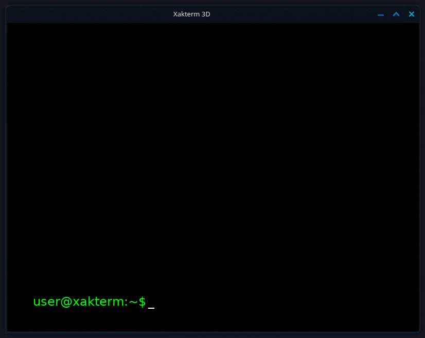

# Xakterm

## Клонируем

git clone

## Установка зависимостей (Debian)

sudo apt update && sudo apt install build-essential libglfw3-dev libglew-dev libfreetype6-dev libglm-dev libgl1-mesa-dev libglu1-mesa-dev

## Компиляция

g++ -std=c++17 -o xakterm xakterm.cpp -lglfw -lGLEW -lfreetype -lGL -lGLU -lm -I/usr/include/freetype2

## Run

./xakterm

